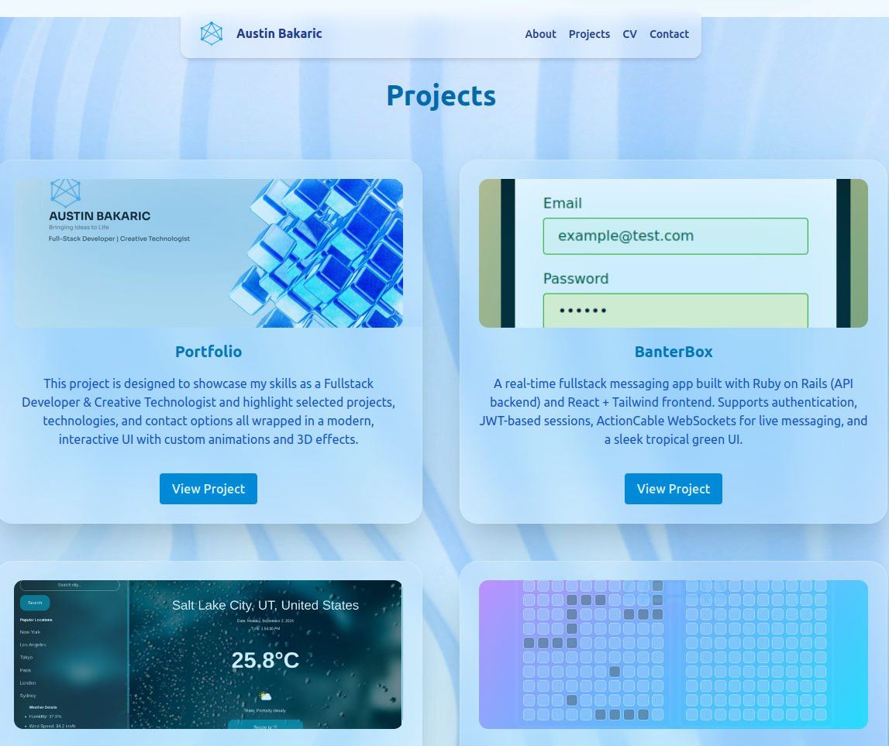
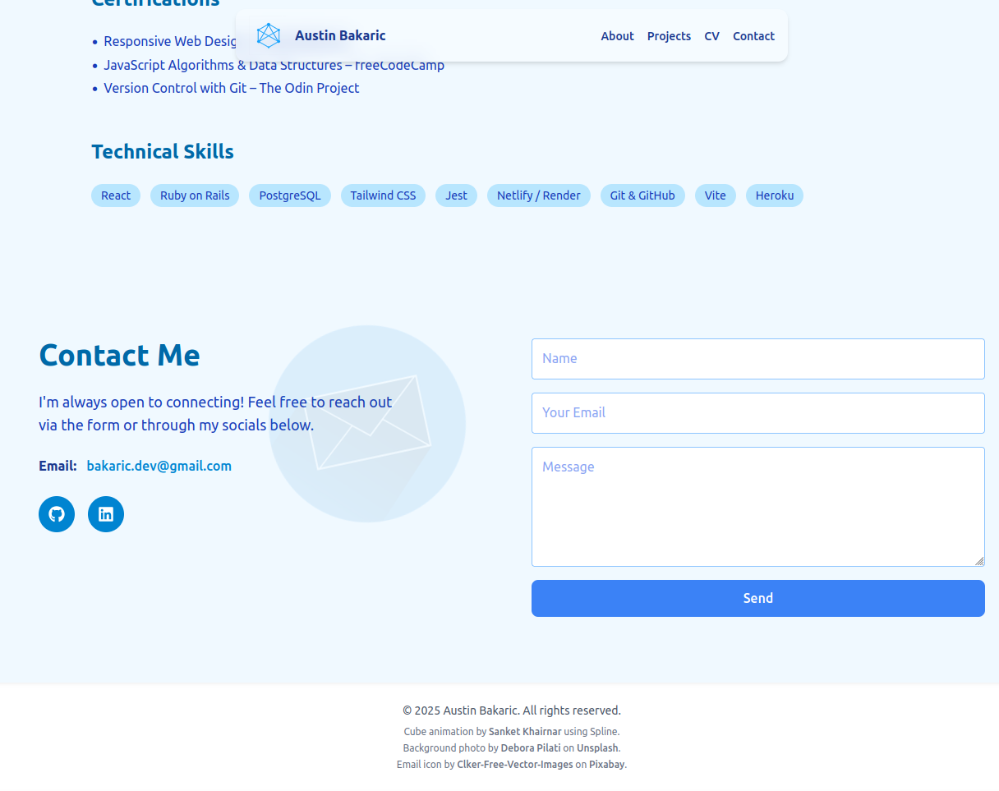

#  Developer Portfolio

Welcome to my personal portfolio website!  
This project is designed to showcase my skills as a **Fullstack Developer & Creative Technologist** and highlight selected projects, technologies, and contact options — all wrapped in a modern, interactive UI with custom animations and 3D effects.

---

##  Features

- Fully responsive React + Tailwind CSS layout  
- Smooth dark/light mode toggle  
- Animated **Spline** 3D hero section  
- Dynamic project display  
- AJAX-powered **contact form** via FormSubmit (no backend)  
- Direct links to GitHub, LinkedIn, and downloadable resume  
- Custom SVG + pattern background  
- Smooth scrolling navigation with interactive icons

---

## Demo

 **Live Site**: [LIVE DEMO](https://portfolio-x1ib.onrender.com/)

📱 **Mobile Support:**  
The site is fully responsive, but for best viewing of the animated Hero section, please rotate your device to **landscape mode**. The hero background is optimized for wide-screen aspect ratios and may not fully display in portrait.

**Screenshots**:
- 
- 
- 
- 

---

## Tech Stack

- **React** (Frontend framework)
- **Tailwind CSS** (Styling + dark mode)
- **Framer Motion** (Animations + parallax effects)
- **React Icons** (Icon library)
- **@splinetool/react-spline** (3D hero visuals)
- **FormSubmit** (Serverless contact form submission)

---

## Installation & Setup

1️⃣ Clone this repository:

```bash
git clone https://github.com/Ajbakaric/your-portfolio-repo.git
cd your-portfolio-repo
````

2️⃣ Install dependencies:

```bash
npm install
```

3️⃣ Run the development server:

```bash
npm run dev
```

4️⃣ Open in your browser:

```
http://localhost:5173
```

---

##  Customization

 **Update Contact Email**
In `ContactForm.jsx`, replace:

```js
action="https://formsubmit.co/ajax/YOUR_EMAIL_HERE"
```

**Update Resume**
Place your resume PDF in `/public/resume.pdf` and link to it in the About or Resume section:

```js
<a href="/resume.pdf" download>Download Resume</a>
```

 **Update 3D Hero Animation**
Swap the Spline scene link in `Hero.jsx`:

```js
<Spline scene="https://prod.spline.design/YOUR-SCENE-ID/scene.splinecode" />
```


##  Developer Notes

* Verify your FormSubmit email (check inbox) to start receiving submissions.
* Check the `tailwind.config.js` and `index.css` if you want to tweak color schemes or animations.
* Update the background pattern in `App.jsx` by swapping the SVG `backgroundImage`.

---

##  Connect with Me

* 🌐[Portfolio](https://your-deployed-site.com)
*  [LinkedIn](https://www.linkedin.com/in/austin-bakaric/)
* [GitHub](https://github.com/Ajbakaric)
*  Email: [bakaric.dev@gmail.com](mailto:bakaric.dev@gmail.com)

---
